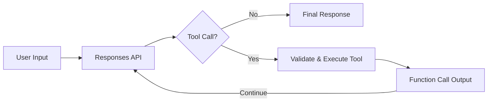

# Artificial Intelligence

A production-minded reference implementation for modern AI application engineering, covering multi-turn orchestration, structured tool use, safe execution boundaries, grounding, and evaluation-aware system design.

The active implementation demonstrates multi-turn interaction, structured function calling, bounded tool orchestration, and safe local tool execution. Earlier Assistants and Chat Completions examples are preserved under `legacy/` for reference.

## What This Project Demonstrates

- OpenAI Responses API
- Multi-turn conversation state
- Structured function calling
- Safe local tool execution
- Tool argument validation and error handling
- Bounded tool-call execution
- Explicit fallback for unsupported external integrations
- RAG architecture design patterns
- Grounding and answer-verification patterns
- AI architecture evaluation
- Agent observability planning

## Architecture



### Request Flow

```text
User Input
    │
    ▼
Responses API
    │
    ├── Direct response ───► User
    │
    └── Function call
            │
            ▼
      Argument validation
            │
            ▼
      Safe local tool runtime
            │
      ┌─────┴──────────────────┐
      │                        │
      ▼                        ▼
Local implementation      Unknown integration
      │                        │
      ▼                        ▼
Structured result        adapter_required
      │                        │
      └────────────┬───────────┘
                   ▼
         function_call_output
                   │
                   ▼
           Responses API
                   │
                   ▼
              Final answer
```

The local tool runtime intentionally performs no external provider actions and handles no credentials. Unsupported tools return an explicit `adapter_required` result instead of simulating successful execution.

## Repository Structure

```text
artificial-intelligence/
├── .github/
│   └── workflows/
│       └── ci.yml
│
├── src/
│   ├── ai_assistant.py
│   └── tool_functions.json
│
├── tests/
│   ├── test_assistant.py
│   └── test_tools.py
│
├── legacy/
│   ├── assistant/
│   │   ├── patterns/
│   │   ├── .env.example
│   │   ├── ai_assistant.py
│   │   ├── README.md
│   │   └── requirements.txt
│   │
│   └── chat_completion/
│       └── search/
│
├── .env.example
├── .gitignore
├── LICENSE
├── requirements.txt
└── README.md
```

### Active vs. Legacy

| Area | Purpose |
|---|---|
| `src/` | Actively maintained Responses API implementation |
| `tests/` | Unit tests for orchestration, tool execution, validation, and state |
| `legacy/assistant/` | Previous Assistants implementation preserved for historical and migration reference |
| `legacy/chat_completion/` | Earlier Chat Completions examples preserved from the repository |

Chat Completions remains supported; it is considered legacy here only relative to this repository's active implementation.

## AI Engineering Tools

The local runtime includes structured examples for:

- `design_rag_pipeline`
- `verify_grounded_answer`
- `evaluate_ai_architecture`
- `create_agent_observability_plan`

Unknown tools are not executed implicitly. They return an `adapter_required` result describing the controls expected from a real external integration.

## Requirements

- Python 3.12+
- OpenAI Python SDK
- OpenAI API key

## Setup

Create and activate a virtual environment:

```bash
python3.12 -m venv .venv
source .venv/bin/activate
```

Install dependencies:

```bash
pip install -r requirements.txt
```

Set your API key:

```bash
export OPENAI_API_KEY="your-openai-api-key"
```

Optionally override the model:

```bash
export OPENAI_MODEL="your-model"
```

## Run

From the repository root:

```bash
python src/ai_assistant.py
```

Example prompts:

```text
Design a grounded RAG architecture for a large document corpus.

Review an AI agent architecture for reliability and observability.

Create an observability plan for a production AI agent.
```

## Tests

Run:

```bash
pytest -q
```

The tests use an injected fake OpenAI client, so they do not require live API calls or an API key.

GitHub Actions runs the test suite automatically on pushes and pull requests to `main`.

## Design Scope

This repository is intentionally compact. It focuses on the Responses API and application-level tool orchestration rather than implementing a complete production platform.

Real external integrations should use dedicated adapters with authentication, authorization, input validation, timeouts, observability, and explicit failure handling.

## License

Licensed under the [MIT License](LICENSE).